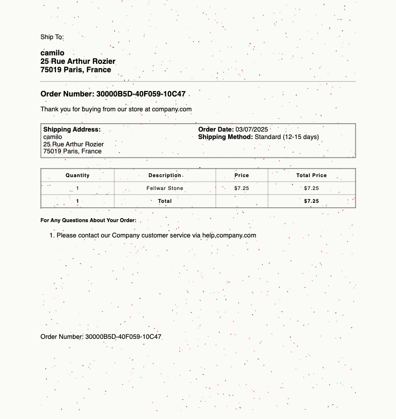

# Textured Web, Printer Ink

This exercise attempts to emulate a printer leaking ink on a reciept through generative CSS.

Note: paintWorklet has [limited browser availability](https://developer.mozilla.org/en-US/docs/Web/API/CSS/paintWorklet_static#browser_compatibility). For more consistent results, view on Chrome.
